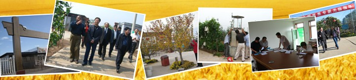

* **2003年** 天汇园建园
* **2005年** 获得由北京市农村工作委员会、北京市质量监督局、北京市农业局和北京市园林绿化局评选的北京市农业标准化生产基地称号
* **2006年** 
 - 获得由北京东方嘉禾认证有限责任公司颁发的有机转换期产品认证证书
 - 泰国公司来园考察
* **2007年** 中国林业产业协会，中国果品流通协会，中国园艺协会，北京市果树产业协会等授予黄金梨、美人指葡萄、富士苹果1系为北京奥运推荐果品，并颁发证书。
* **2008年** 
  - 完成三年有机果品转换过渡期。每年检验均符合国家有机果品过渡期标准，并授予证书。
  - 昌平区人大代表来园指导
* **2009年** 昌平苹果节专家来园参观指导
* **2010年** 日本专家组来园参观指导
* **2012年** 源天汇园网站建立
* **2015年** 微信公众号建立
* **2016年** 淘宝网店成立
* **2017年** 源天汇园网站改版