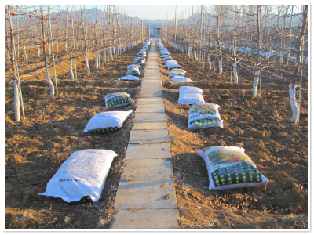

####有机农业

指在动植物生产过程中不使用化学合成的农药、化肥、生产调节剂、饲料添加剂等物质，以及基因工程生物及其产物，而是遵循自然规律和生态学原理，采取一系列可持续发展的农业技术，协调种植业和养殖业的平衡，维持农业生态系统持续稳定的一种农业生产方式。

####有机食品

有机食品也叫生态或生物食品。有机食品是目前国标上对无污染天然食品比较统一的提法。有机食品通常来自于有机农业生产体系，根据国际有机农业生产要求和相应的标准生产加工的。
有机食品与绿色食品的区别

绿色食品是中国政府主推的一个认证农产品，他有绿色AA级，和A级之分，而其AA级的生产标准基本上等同于有机农业标准。绿色食品是普通耕作方式生产的农产品向有机食品过渡的一种食品形式。有机食品是食品行业的最高标准。

**有机食品判断标准**

1. 原料来自于有机农业生产体系或野生天然产品；
2. 有机食品在生产和加工过程中必须严格遵循有机食品生产、采集、加工、包装、贮藏、运输标准，禁止使用化学合成的农药、化肥、激素、抗生素、食品添加剂等，禁止使用基因工程技术及该技术的产物及其衍生物。
3. 有机食品生产和加工过程中必须建立严格的质量管理体系、生产过程控制体系和追踪体系，因此一般需要有转换期；这个转换过程一般需要2-3年时间，才能够被批准为有机食品。
4. 有机食品必须通过合法的有机食品认证机构的认证。

####天汇园运用的先进技术
      
为了使天汇园出品的水果符合有机产品的要求，并且降低病虫害的干扰，我园使用了一下先进的技术与之相配合：

1. **防鸟网**：防鸟网是一种既经济又安全可靠的植物保护系统。可以有效地防止果树受鸟类侵扰，从而提高水果的产量及质量，保证果面的完整。

2. **诱虫灯**：运用特殊诱虫灯管光源、特效诱虫粘纸，强烈吸引蚊蝇虫飞入后，并将其粘到粘虫纸上，从而杀捕蚊蝇虫，其特点为：安全高效的捕杀蚊蝇虫，不使用任何化学药品，环保性很好

 

3. **反光膜**：果实色泽是苹果外观品质的主要指标之一，近年来，我园应用铺设反光膜技术，在提高果实色泽方面取得了显著效果。果园铺设反光膜是通过反光膜对阳光的反射、辐射，来改善整个果园尤其是树冠内膛、下裙枝等部位的光照条件，使这些部位的果实尤其是果实不易着色的部位充分着色，增加全红果数量，进而达到提高苹果外观质量的目的。

4. **套袋**：水果套袋在不影响、不损害水果正常生长与成熟的前提下，不仅隔离农药与环境污染使水果无公害，而且通过隔离病虫害及尘土的作用使成熟水果表面光洁、色泽鲜艳，提高了水果档次，效益显著。通俗的讲，水果套袋就是水果的外衣，也是保护膜。水果套袋一般由纸制和PE（塑料薄膜）两种材料制成，有袋状和网状，根据不同的水果其尺寸和规格也不尽相同，颜色也土黄，浅褐色居多。

5. **选果机**：用于苹果、梨、桃等圆形果实的重量分级、分拣包装，从而提高水果装箱的效率及美观程度。

6.**使用有机肥**：主要来源于植物和（或）动物，施于土壤以提供植物营养为其主要功能的含碳物料。经生物物质、动植物废弃物、植物残体加工而来，消除了其中的有毒有害物质，富含大量有益物质，包括：多种有机酸、肽类以及包括氮、磷、钾在内的丰富的营养元素。不仅能为农作物提供全面营养，而且肥效长，可增加和更新土壤有机质，促进微生物繁殖，改善土壤的理化性质和生物活性，是绿色食品生产的主要养分。

