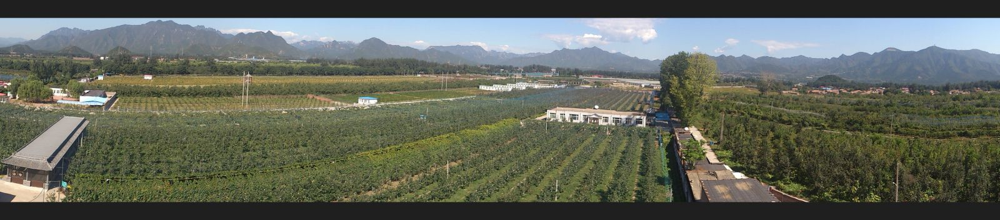

天汇园有机果品观光采摘园位于昌平区天寿山麓，东靠十三陵水库，西邻十三陵神路，南邻昌平城区，北依长陵景区。处于北京西北地区旅游枢纽位置。其自然环境幽雅，北部的天寿山主峰三峰并峙，东、西、北三面形成环抱式天然屏障，环山之内，是洪水冲击形成的小盆地，天汇园处于小盆地最高点。伫立平原北望，群山巍峨，层峦叠嶂；登高南眺，川原开阔。此地土壤肥沃，雨量充沛，日照充足，昼夜温差大，四季分明，空气清新自然，是种植果树的天然基地。天汇园区占地85亩，主要从事高档精品水果生产，是昌平区大型观光采摘园之一。春天鲜花盛开，蜜蜂飞舞。初夏时节的桃子、樱桃竟显芳姿。一年四季景色迷人。

自建园以来，土地一直使用有机肥沟施，用诱虫灯捕杀害虫。2005年获得由北京市农村工作委员会、北京市质量监督局、北京市农业局和北京市园林绿化局评选的北京市农业标准化生产基地称号。2006年获得由北京东方嘉禾认证有限责任公司颁发的有机转换期产品认证证书，到2008年完成三年有机果品转换过渡期。每年检验均符合国家有机果品过渡期标准，并授予证书。2007年由中国林业产业协会，中国果品流通协会，中国园艺协会，北京市果树产业协会等授予黄金梨、美人指葡萄、富士苹果1系为北京奥运推荐果品，并颁发证书。
园内，由昌平区高级果树专家进行指导，采用先进的种植技术，对各类果树进行科学管理，如苹果树栽培和管理引进日本先进的细纺垂技术，梨树选用先进品种及采用现代化的网架式种植方法，使这里的水果不仅色泽鲜艳，且口味极佳。

目前本园种植的主要果品有：苹果、梨、葡萄、樱桃、桃等。其中，苹果为王林和SH6矮化中间砧型富士苹果。梨的品种主要有绿宝石、爱甘水、圆黄、黄金、丰水、新高、早红考密斯、大果水晶等。葡萄主要有天缘奇、峰后、美人指、克瑞森等品种。樱桃主要有抉择、早大果。桃的品种有清水白桃、赤月桃、川中岛白桃、大玉白凤及白桃。